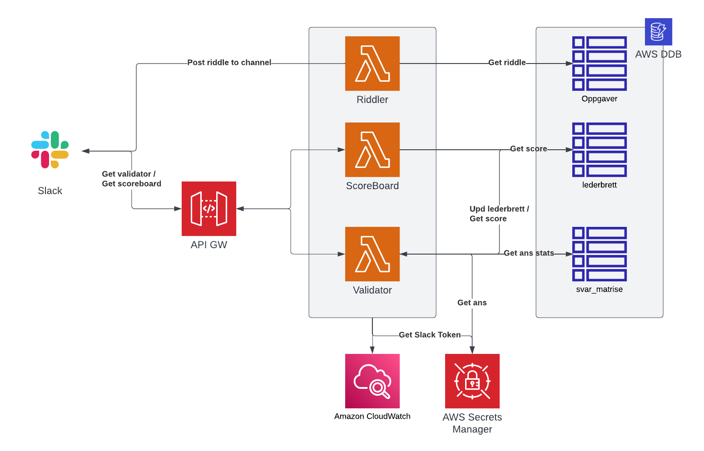

### RiddleBOT
SlackBot for setting up a game of riddles w scoreboard in a designated channel.

## Slack set-up
Under OAuth & Permissions the following scopes are needed
Scopes
- channels:history, channels:read
- chat:write
- im:history, im:read
- mpim:write
- usergroups:read
- users:read, users:read.email 

#### Interactivity and shortcuts - used for scoreboard
RequestURL : `https://atpl2n15th.execute-api.us-east-2.amazonaws.com/default/showPoints`
Must match API GW url of function that is triggered based on the interactivity.
Add shortcut 
* poengtavle, at `GLOBAL` location with callbackId poengtavle

#### Event Subscriptions- used for validator
Set RequestURL : `https://atpl2n15th.execute-api.us-east-2.amazonaws.com/default/validator`
Must match API GW url of function that is triggered based on the interactivity.
This is the endpoint for all incoming requests to the bot
---
!! After set-up is done store Bot User OAuth Token in AWS key vault and reinstall app to workspace

## Validator
Main logic and interaction point for users, validates and updates score. 

## getScoreBoard
Select few can trigger the scoreboard command defined in the admins array. Will post
scoreboard to the Slack channel defined.

## Riddler
Post predefined tasks to channel once a day. Riddles are fetched form DynamoDB 
instance.

1. Function will run once a day at 08:00
2. Dependent on fetching keys corresponding to date the function is ran, eg 01.01.2022 = dag_1 in the dictionary
3. Update riddle keys riddle dict stored in aws dynamo DB to the keys you store the riddles at
4. Package the slack-sdk library with the function to enable execution

### Improvements to be done
* IaaC scripts
* Timezone stuff
* Move vars to config files
* Dev/Ops pipelines