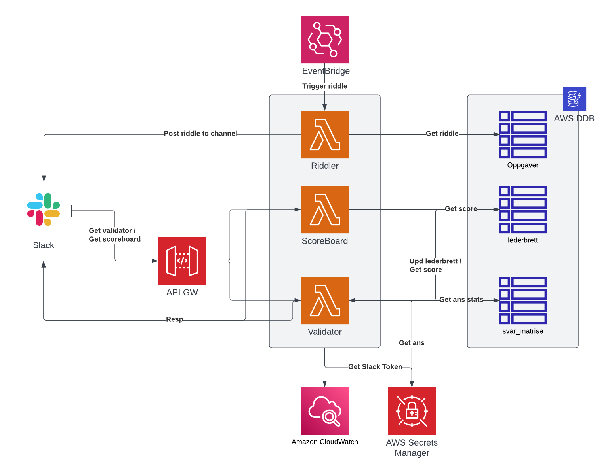

# RiddleBOT
SlackBot for setting up a game of riddles w scoreboard in a designated channel.

## Slack set-up
Add a new app and copy the app manifest. Trigger endpoint approval and check that the functions
returns the auth challenge. 
!! After set-up is done store Bot User OAuth Token in AWS key vault and reinstall app to workspace

## Validator
Main logic and interaction point for users, validates and updates score. 

## GetScoreBoard
Select few can trigger the scoreboard command defined in the admins array. Will post
scoreboard to the Slack channel defined.

## Riddler
Post predefined tasks to channel once a day. Riddles are fetched form DynamoDB 
instance.

1. Function will run once a day at 08:00
2. Dependent on fetching keys corresponding to date the function is ran, eg 01.01.2022 = dag_1 in the dictionary
3. Update riddle keys riddle dict stored in aws dynamo DB to the keys you store the riddles at
4. Package the slack-sdk library with the function to enable execution

### Infra req
se photo for components, also need IAM roles for AWS Lambdas w correct permissions to read and update 
secrets and AWS DDB tables

### Improvements to be done
* Add tests
* IaaC scripts
* Move vars to config files
* Dev/Ops pipelines
* Move common snippets to a common folder (to be packaged in depl pipeline)